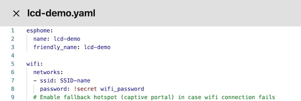

# ESP32-Cheap-Yellow-Display with ESPHome

This is a basic YAML configuration to get the ESP32-2432S028R display working with ESPHome. It creates two rectangles that act as binary touch sensors in Home Assistant, and includes a built-in web interface.

   

Originally written by Jonny Bergdahl.

- [Sample GitHub reference](https://github.com/witnessmenow/ESP32-Cheap-Yellow-Display/tree/main/Examples/ESPHome/4-TouchDemo)
- [Display code reference](https://github.com/witnessmenow/ESP32-Cheap-Yellow-Display/tree/main)

## Setup Instructions

1. **Create a New Device:**
   Start by creating a new ESPHome device named "lcd-demo" without any extra configuration.

   

2. **Edit the Device:**
   Open the device and paste the code from the `lcd-demo.yaml` file. Ensure you update the Wi-Fi and OTA passwords to allow for over-the-air updates later.

   

3. **Install the Firmware:**
   Upload the firmware via USB from your local machine.

   **Important:** To successfully build the configuration, create a folder named `fonts` in your ESPHome directory, and copy the file `fonts/Arimo-Regular.ttf` into it.

   

4. **Check the Web Interface:**
   After installation, check the status of the device using the web UI by clicking the "Visit" button.

   
